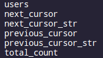
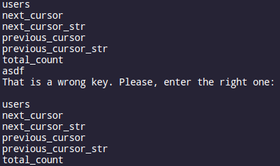
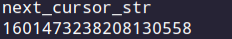

# move_in_json
This module helps the user to move within a json object presented as a python dictionary. At first the user is shown all avaiable keys in the dictionary:

Then (s)he has to input a key. If it is wrong, the output will be next:

Otherwise:
